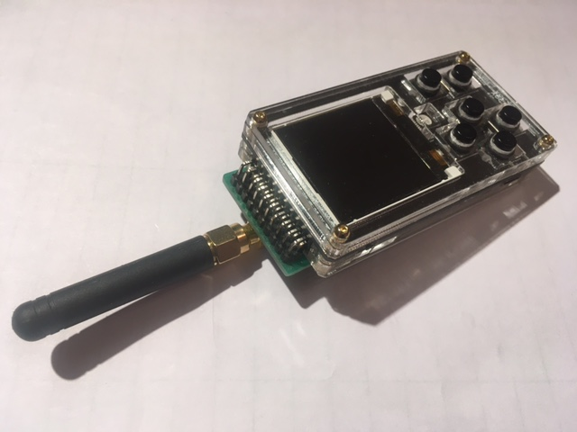

# ESPboy_Sub1GHzInspector

[Demo video](https://youtu.be/BxWNkIO8hpA)

The ESPboy CC1101 chip module allows you to inspect Sub1Ghz signals (300-348MHz, 387-464MHz, 779-928MHz). 
Scan, decode, store to open garage doors, barriers, IoT sensors...

You can buy this module ready-made or make it yourself.

## 1. Buy CC1101

- Blue with antenna [link to buy](https://aliexpress.ru/item/2055139086.html?sku_id=50596123696&spm=a2g2w.productlist.0.0.4b09bf65eOzht2)

- Green with antenna [link to buy](https://aliexpress.ru/item/32858516951.html?sku_id=65340950183&spm=a2g2w.productlist.0.0.24475f0432NP99)

## 2. Connect CC1101 to ESPboy

for blue CC1101 version

- 1 >> GND
- 2 >> VCC
- 3 >> D4, GPIO2
- 4 >> D8, GPIO15, SS
- 5 >> D5, GPIO14, SCK
- 6 >> D7, GPIO13, MOSI
- 7 >> D6, GPIO12, MISO
- 8 >> RX, GPIO3, RX

for green CC1101 version

- GND  >> GND
- 3V3  >> VCC
- G0D0 >> D4, GPIO 2
- CSN  >> D8, GPIO15, SS
- SCK  >> D5, GPIO14, SCK
- MOSI >> D7, GPIO13, MOSI
- MISO >> D6, GPIO12, MISO
- GD02 >> RX, GPIO3, RX

## 3. Upload this firmware

NOTE: Before compilation, set Arduino IDE settings

-  Board:  ESP8266 WeMos D1 mini
-  CPU frequency: 160Mhz

## 4. Useful links

- [Buy ESPboy](https://www.tindie.com/products/23910/)
- [DIY ESPboy](https://easyeda.com/ESPboy)
- [Main Web site](https://www.espboy.com)
- [YouTube channel](https://www.youtube.com/c/ESPboy)
- [Community](https://community.espboy.com)
- [Discord chat](https://discord.gg/kXfDQpX)
- [Twitter](https://twitter.com/ESPboy_edu)
- [Software](https://github.com/ESPboy-edu)
- [Contact: espboy.edu@gmail.com](mailto:espboy.edu@gmail.com)

[Check the description here](https://community.espboy.com/t/espboy-sub1ghz-inspector-cc1101-module/70/7)
